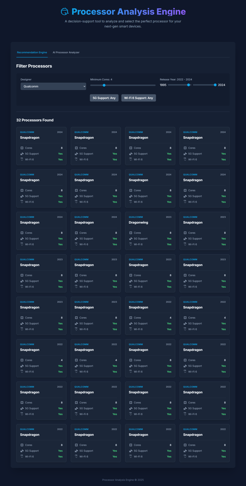

# 🧠 Processor Recommendation Engine (Original Monolithic App)

This repository contains the **original, monolithic version** of the Processor Recommendation & Analysis Engine. It is a complete, standalone Flask application that handles data processing, model inference, and HTML frontend rendering in a single codebase.

---

### ✨ Project Evolution: Now a Full-Stack Application!

This project was successfully evolved into a modern, decoupled, full-stack application with a separate, interactive React frontend and a containerized Python backend API.

  <h4>New Full-Stack Version</h4>
  

#### 🔗 **Explore the Full-Stack Version:**

| Link                               | URL                                                                                                         |
| :--------------------------------- | :---------------------------------------------------------------------------------------------------------- |
| 🚀 **Live Demo**                   | **[processor-analysis-frontend.vercel.app](https://processor-analysis-frontend.vercel.app/)** |
| 🎨 **Frontend Repository (React)** | [github.com/MdEhsanulHaqueKanan/processor-analysis-frontend](https://github.com/MdEhsanulHaqueKanan/processor-analysis-frontend) |
| ⚙️ **Backend API Repository (Flask)** | [github.com/MdEhsanulHaqueKanan/processor-recommendation-api](https://github.com/MdEhsanulHaqueKanan/processor-recommendation-api)       |

*(Note: The backend server on the free tier may spin down after inactivity. Please allow up to a minute for the app to "wake up" on your first visit.)*

---

## Key Achievements (of this Original Version)

*   **Custom-Trained ML Models (92.7% Accuracy):** Engineered the complete pipeline from data cleaning and feature engineering to training and hyperparameter tuning a multi-class classification model, lifting final performance by **2.6%**.
*   **Data-Driven Feature Creation:** Engineered **9 new, structured features** from raw, unstructured text fields, which were critical for the ML models' success.
*   **End-to-End Monolithic Deployment:** Architected and deployed a modular Flask application serving **2 distinct ML models**, fully containerized with Docker for reproducible deployment on Render.
*   **Robust Data Handling:** Successfully processed and analyzed a real-world dataset of over **1,000 unique processors**.

---

## The ML Pipeline & Technical Deep Dive

This project was more than just training a model; it was about building a reliable system. The process involved:

### 1. Data Processing & Feature Engineering
A key challenge was handling inconsistent string formats. I wrote functions to parse numeric values and boolean flags from text fields using regex and string manipulation in Pandas. I also engineered new, more useful features (like `has_5g`) from unstructured text columns.

### 2. Model Training & Selection
The task was framed as two distinct ML problems: a **multi-class classification** problem for the processor's function and a **multi-label classification** problem for its wireless capabilities. The entire process, including model selection (`RandomForestClassifier`) and hyperparameter tuning, is documented in the `notebooks/` directory.

### 3. Deployment & MLOps
The monolithic application was containerized using **Docker** and deployed with a **Gunicorn** production server. Performance was optimized for resource-constrained environments using Gunicorn's `--preload` flag to share model memory between workers.

---

## Technology Stack

| Category | Technology |
| :--- | :--- |
| **Backend** |   |
| **Machine Learning** |    |
| **Frontend** |   |
| **Deployment** |    |

---

<strong>Click to view Original App Screenshots & Local Setup</strong>

### Application Screenshots (Original Monolithic Version)
| Recommendation Engine | Recommendation Results | Processor Analyzer |
| :---: | :---: | :---: |
|  |  |  |

### Running the Original Application
This project can be run locally for development or with Docker to replicate the production environment.

#### Option 1: Running Locally (for Development)
1.  **Clone the repository** and `cd` into it.
2.  **Create and activate a virtual environment.**
3.  **Install dependencies:** `pip install -r requirements.txt`
4.  **Run the Flask development server:** `python run.py`
5.  Open your browser to `http://127.0.0.1:5000`.

---